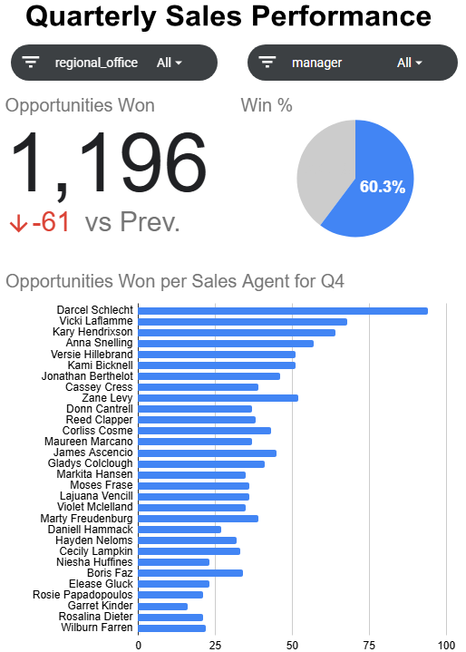

# CRM Sales Performance Dashboard

An interactive Google Sheets dashboard for Sales Managers to monitor quarterly sales performance, win rates, and individual sales agent performance.

## Dashboard

🔗 **[View the Interactive Google Sheets Dashboard](https://docs.google.com/spreadsheets/d/1F6O6bZ7XbsBm5cMaMbIFrmTVxx5lbfZzvlmp1dNgJ7A/edit?usp=sharing)**

## Overview

This project analyzes sales opportunity data to help Sales Managers evaluate team performance across quarters, regional offices, managers, and individual sales agents.

Using Google Sheets, I created pivot tables to summarize key sales metrics and used the results to build an interactive dashboard with filters for regional office and manager.

## Key Insights

- Analyzed quarterly opportunities won and win rates
- Compared sales performance across individual sales agents
- Evaluated performance across regional offices
- Enabled managers to filter results by regional office and manager
- Identified differences in performance between sales agents and teams

## Tools & Skills

- Google Sheets
- Pivot Tables
- XLOOKUP
- Data Analysis
- Data Aggregation
- Dashboard Development
- Interactive Filtering

## Dataset

The dataset contains sales opportunity records including:

- Sales agent
- Product
- Account
- Deal stage
- Engagement date
- Close date
- Close value
- Manager
- Regional office

## Project Context

Completed as a guided project from Maven Analytics to practice business-oriented data analysis and dashboard development in Google Sheets.
